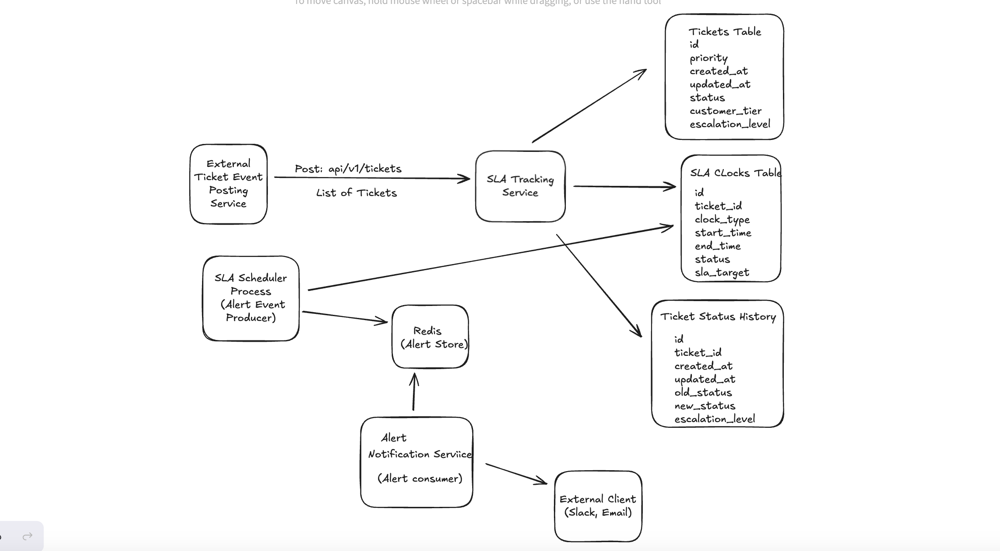

## High Level Architecture

# REQUIREMENTS IMPLEMENTED
 - FR1 - Ingestion Endpoint – POST /tickets (FastAPI). Accept JSON representing a batch of ticket events ( id , priority , created_at , updated_at , status , customer_tier ). Idempotent by id + updated_at .

  - FR2 - Persistence – Store tickets in PostgreSQL . The model must support status history and multiple SLA clocks (response, resolution).

  - FR3 - SLA Engine – A background scheduler evaluates every minute. For each open ticket it computes remaining time for each SLA. If ≤ 15 % remains, create an Alert record.

  - FR4 Not complete - Escalation Workflow – Currently, the notification is just logged

  - FR5 Configuration – SLA targets per priority and customer_tier are read from sla_config.yaml at start‑up. Hot‑reload on file change (watchdog).

  - FR9 Not complete - Docker & Local Dev – Provide docker-compose.yaml that starts service, PostgreSQL, and a mock Slack endpoint container for local testing. The mock Slacn endpoint is not present. Currently, the process just logs after fetching the alert.

## FUTURE IMPROVEMENTS

# Ticket State Management
Current states: open, responded, closed
Add support for:
More granular states: new, triaged, assigned, waiting_for_customer, etc.
A proper state transition engine

# SLA Scheduler Service 
- Currently, the background service runs every 1 minute. This means that the service has to process the alerts within 1 minute before next run commences. This could lead to delay in SLA breach detection

# Testing
Adding unit tests and integration tests

# LoggingMiddleWare
- Current service doesn't have a centralized logging middleware

